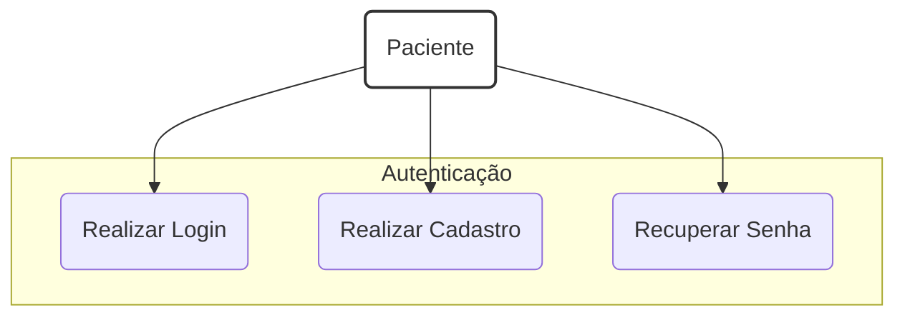
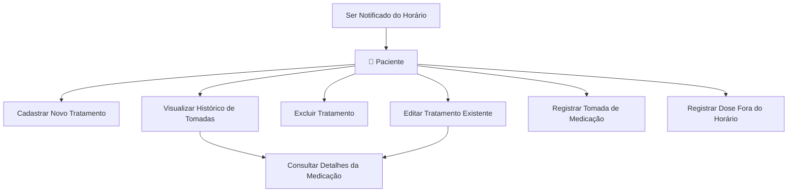

## 📊 Diagramas da Aplicação

Aqui estão os diagramas de Caso de Uso que descrevem as principais interações do usuário com o sistema Amparo.

### Autenticação do Paciente

O fluxo de autenticação cobre o cadastro, login e recuperação de senha do paciente.

### Gerenciamento de Medicação

Este diagrama mostra as funcionalidades centrais do aplicativo relacionadas ao gerenciamento dos tratamentos e lembretes.

