## 📊 Diagramas da Aplicação

Aqui estão os diagramas de Caso de Uso que descrevem as principais interações do usuário com o sistema Amparo.

### Autenticação do Paciente

O fluxo de autenticação cobre o cadastro, login e recuperação de senha do paciente.

```mermaid
graph TD
    subgraph Autenticação
        direction LR
        uc_login("Realizar Login")
        uc_cadastro("Realizar Cadastro")
        uc_recuperacao("Recuperar Senha")
    end

    ator_paciente(Paciente) --> uc_login
    ator_paciente --> uc_cadastro
    ator_paciente --> uc_recuperacao

    style ator_paciente fill:#fff,stroke:#333,stroke-width:2px
```

### Gerenciamento de Medicação

Este diagrama mostra as funcionalidades centrais do aplicativo relacionadas ao gerenciamento dos tratamentos e lembretes.

```mermaid
graph TD
    Paciente["👤 Paciente"]
    
    Paciente --> Cadastrar["Cadastrar Novo Tratamento"]
    Paciente --> Editar["Editar Tratamento Existente"]
    Paciente --> Excluir["Excluir Tratamento"]
    Paciente --> Visualizar["Visualizar Histórico de Tomadas"]
    Paciente --> RegistrarTomada["Registrar Tomada de Medicação"]
    Paciente --> RegistrarForaHorario["Registrar Dose Fora do Horário"]
    Notificar["Ser Notificado do Horário"] --> Paciente
    
    Visualizar --> Detalhes["Consultar Detalhes da Medicação"]
    Editar --> Detalhes
```

